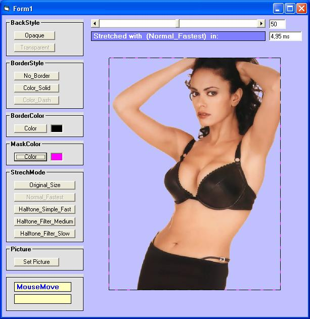



## Fast Transparent Picturebox Ocx Control

### Description

A Transparent Picturebox Ocx that solves the problem to use the Halftone stretch mode with an alpha maskcolor picture, think this Ocx is useful for game programing, graphics programing and others, Please Vote !!!
 
### More Info
 

             |
---                |---
**Submitted On**   |2007-03-22 16:40:02
**By**             |[\\\_Alex\_/](https://github.com/Planet-Source-Code/PSCIndex/blob/master/ByAuthor/alex.md)
**Level**          |Intermediate
**User Rating**    |4.8 (24 globes from 5 users)
**Compatibility**  |VB 6\.0
**Category**       |[Custom Controls/ Forms/  Menus](https://github.com/Planet-Source-Code/PSCIndex/blob/master/ByCategory/custom-controls-forms-menus__1-4.md)
**World**          |[Visual Basic](https://github.com/Planet-Source-Code/PSCIndex/blob/master/ByWorld/visual-basic.md)
**Archive File**   |[Fast\_Trans2055393222007\.zip](https://github.com/Planet-Source-Code/alex-fast-transparent-picturebox-ocx-control__1-68189/archive/master.zip)

